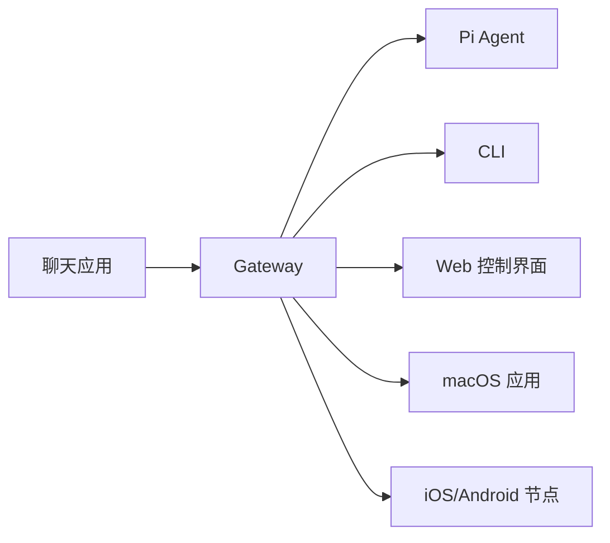

# OpenClaw

**类型:** 项目/平台

## 概述

OpenClaw 是一个自托管的多通道 AI Agent 网关，连接各种聊天应用到 AI 编程 Agent（如 Pi）。

**口号:** _"EXFOLIATE! EXFOLIATE!"_ — 一只太空龙虾

## 核心特性

- **自托管**: 运行在自己的硬件上，数据自主可控
- **多通道**: 同时服务 Discord、Telegram、WhatsApp、QQ 等 20+ 平台
- **Agent 原生**: 内置工具调用、会话管理、记忆系统、多 Agent 路由
- **开源**: MIT 许可证，社区驱动

## 架构组件



## 关键能力

| 能力 | 说明 |
|------|------|
| 多通道网关 | Discord、iMessage、Signal、Slack、Telegram、WhatsApp、WebChat 等 |
| 插件通道 | Matrix、Nostr、Twitch、Zalo 等 |
| 多 Agent 路由 | 每个 Agent 独立会话、工作空间 |
| 媒体支持 | 图片、音频、文档收发 |
| Web 控制界面 | 浏览器仪表板 |
| 移动节点 | iOS/Android 节点，支持 Canvas、相机、语音 |

## 技术栈

- **运行时**: Node.js 24 (推荐) 或 22 LTS
- **协议**: WebSocket
- **默认端口**: 18789
- **配置**: JSON5 (~/.openclaw/openclaw.json)

## 快速开始

```bash
# 安装
npm install -g openclaw@latest

# 初始化
openclaw onboard --install-daemon

# 启动仪表板
openclaw dashboard
```

## 相关概念
- [[Gateway_Architecture]]
- [[Agent_Runtime]]
- [[Multi_Agent_Routing]]
- [[Session_Management]]

## 相关来源
- [[sources/2026-04-06-openclaw-docs-index]]
